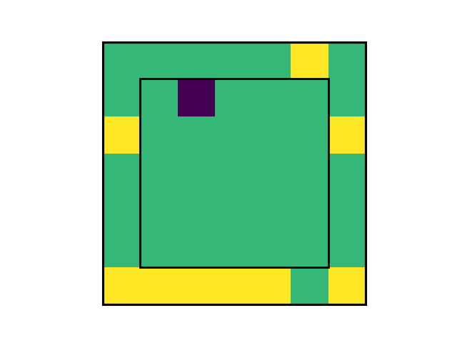

# Influence Aware Memory PyTorch

Pytorch implementation of the [Influence-aware Memory Architectures for Deep Reinforcement Learning by Suau et al](https://arxiv.org/abs/1911.07643) using [pytorch-a2c-ppo-acktr-gail by Ilya Kostrikov](https://github.com/ikostrikov/pytorch-a2c-ppo-acktr-gail).

## Installation

To use please run the following command to install the required packages:
```
pip install -r requirements.txt
```

To be able to run the warehouse environment it needs to be registered to gym for new processes. This can be done by adding the following line to the gym.envs.\_\_init\_\_.py file:
```
register("Warehouse-v0", entry_point="environments.warehouse.warehouse:Warehouse", kwargs={"seed": 0, "parameters": {"num_frames": 1}})
```

## Running

The Warehouse envorinment can be run with a parallel IAM architecture, GRU architecture, just linear layers, or linear layers with 8 frames stacked using, respectively, the commandline arguments _IAM_, _RNN_, _FNN_ or _FNN8_ on the file _main.py_.

A Google Colab notebook that sets up the environment as needed, trains on the Warehouse environment and saves the results to Google Drive can be found here:
https://colab.research.google.com/drive/1nlj8GNdoFGpXgeY29Q7ZfjNc7A_0PEyL?usp=sharing

## Results
All results of the reproduction including plotting and raw data can be found in the results folder. 

## Warehouse Environment
Preview of the warehouse environemnt:
